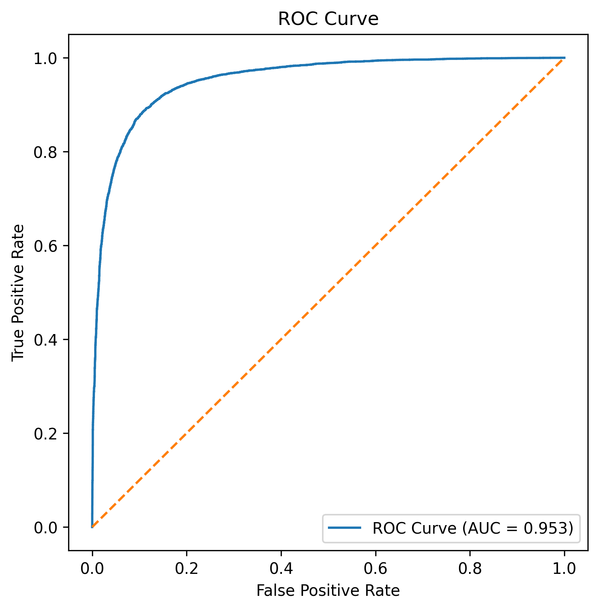

# Protein Function Prediction Using Deep Learning

This repository contains the complete Phase-1 implementation for predicting enzymatic function from protein sequences using a CNN–BiLSTM architecture.

## Overview

Protein function prediction is a core task in bioinformatics. This project formulates enzyme prediction as a binary classification problem using curated Swiss-Prot protein sequences.

## Dataset

- Source: Swiss-Prot (UniProt)
- Classes:
  - Enzyme (with EC number)
  - Non-Enzyme (without EC number)
- Dataset size: 100,000 sequences (balanced)
- Sequence length: 50–1000 amino acids

## Dataset Access

Due to GitHub file size limitations, the processed dataset is hosted externally.

- **Dataset:** Swiss-Prot Enzyme / Non-Enzyme Binary Dataset
- **Size:** ~189 MB
- **Download link:**  
  https://drive.google.com/file/d/12PQ08SJlLR1ZfBKJYVAgx6AZJiKxQnJp/view?usp=sharing

### Dataset Description

- Source: Swiss-Prot (UniProt)
- Classes:
  - Enzyme (with EC number)
  - Non-Enzyme (without EC number)
- Total samples: 100,000 (balanced)
- Sequence length: 50–1000 amino acids

After downloading, place the file inside the `data/` directory

#### Alternatively, download via script:

```bash
python src/download_data.py
```

## Model Architecture

- Embedding layer
- 1D Convolutional Neural Network (CNN)
- Max Pooling
- Bidirectional LSTM
- Fully connected layers
- Sigmoid output layer

## Training Details

- Optimizer: Adam
- Loss: Binary Cross-Entropy
- Batch size: 32
- Epochs: 15

## Results

- Validation Accuracy: 88.67%
- ROC-AUC: 0.953

### Confusion Matrix


### ROC Curve



## Project Structure

This repository contains the following files and directories:

- `data/`: dataset files used for training and evaluation
  - `data/swissprot_binary_sampled.csv` — sampled CSV used for quicker experiments
  - `data/swissprot_binary.csv` — full dataset CSV
  - `data/uniprot_sprot.tsv` — original UniProt/Swiss-Prot TSV
- `figures/`: output images generated by evaluation (`confusion_matrix.png`, `roc_curve.png`)
- `models/`: saved model artifacts
  - `models/predictor.h5` — trained Keras model used for inference/evaluation
- `src/`: source code
  - `src/data_loader.py` — data loading and preprocessing utilities
  - `src/tsv_to_csv.py` — helper to convert TSV to CSV
  - `src/sample_dataset.py` — script to sample the dataset for quick runs
  - `src/model.py` — model architecture definition
  - `src/train.py` — training script
  - `src/predict.py` — prediction/inference utilities
  - `src/evaluate.py` — evaluation, metrics and plotting (generates `figures/`)
- `requirements.txt`: Python dependencies
- `phase1.md`: project report for Phase-1
- `README.md`: this file (project overview and instructions)

## Phase-2 (Future Work)

Phase-2 will focus on robustness evaluation and cross-dataset generalization analysis.

## Requirements

Install dependencies using:

```bash
pip install -r requirements.txt
```

## Author

- Sahal Imran
- Jaipreet Kaur
